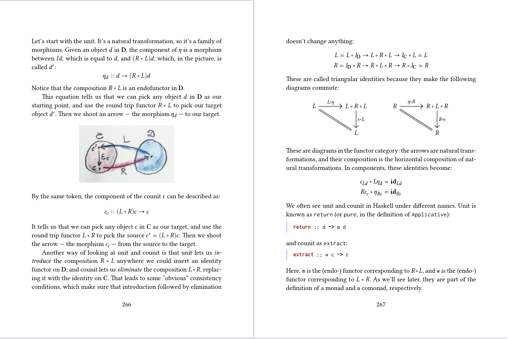

# Motivation: 
  - Dr. David Spivak and Dr. Ryan Wisenesky's work with Applied Category Theory for Categorical Databases
  - The main open source website: https://www.categoricaldata.net/
  - The GitHub Repository: https://github.com/CategoricalData --> https://github.com/CategoricalData/CQL --> https://github.com/CategoricalData/FQL, https://github.com/CategoricalData/hydra
  - The main motivating presentation: https://www.youtube.com/watch?v=bk36__qkhrk ( Categorical Databases - Topoi Institute)

  - strangely I would like arbitrary payloads, arbitary credentials that I can automagically map to opportunities. why stick to a predefinaed major, that's boring. focus on the atoms and build something new. Subset: present multiple credentials as a single credential. I thought credential chaining was related
    to this thought trail, but after more thinking it isn't. https://lists.w3.org/Archives/Public/public-credentials/2022Jun/0070.html ( I guess you still might have one credential that precedes another though). this thinking started with EISPP / Master17 / A Distributed Economy Writings
    ( http://bshambaugh.org/eispp, http://bshambaugh.org/eispp/ch_1_2_VRM/PNG/EISPP_directional_graph_2fresnel_gss_vrm2accesscontrol.png, http://bshambaugh.org/Master_17.html, http://adistributedeconomy.blogspot.com/2012/03/knowledge-discovery-with-semantic-web.html )  
    - Essentially the reflection of  EISPP et. al in the modern day is to rewrite the existing higher education / deliverables / and experience to employment pipeline to allow for heterogeneous credentials that are based on people's unique qualities and less on prexisting professions such as
      electrical, mechanical, chemical, aerospace, and industrial engineering (+ many non-stem areas) which come to represent and/or supplant one's identity/avatar in the common conciousness. Technology first; laws and culture will follow. These may be more cost effective than existing credentials since amendments
      or repairs may be more easily made without starting again from the beginning utilizing little or none of the "good" parts of prexisting credentials (if indeed they behave that way due to their nature in the societial fabric for a particualr individual).

# Questions:
  - "Some part of verifiable credentials will need to fit this definition in order for Applied Category Theory to be useful. (See attachment) I have theories, which are alluded to on GitHub." -Brent Shambaugh
    (attachment -> Section 1.3 (definition of a category) of Adowey's book: https://www.andrew.cmu.edu/course/80-413-713/notes/chap01.pdf
  - "Benjamin Braatz goes into category theory for RDF so maybe this is useful for defining a category. Steve Adowey goes into the relationship between groups and categories, so this may help relating cryptographic signatures (based on groups) to categories.
  - "The payload is a category, perhaps of RDF, which fits in the category of cryptographic signatures?"
      - note: pararphasing "A Functor embeds one category inside another". pg 107, category theory for programmers. Bartosz Milewski
         
        More about Functors from the Science of Functional Programming by Segei Winitzski
  - Do credentials or signed payloads form a category? What are the arrows? What are the objects?
   ( You can probably find a paper of signed payloads. ECDSA signatures applied to category theory must be structure perserving?)
  - Can I embed the thinking of Benjamin Braatz Thesis of Category Theory Applied to RDF and Dr. Joshua Shinavier's and Dr. Ryan Wiseneky's  work of algebraic property graphs  and the thinking of a group as a category and ECSDA signatures applied to category theory 

# Look at the Defintion of a Group:
   - Chapter 5 - Key Exchanges, Real World Cryptography, David Wong
   - Group Theory and Its Applications to Physical Problems - Morton Hammermesh

# Look at Groups Mapped to Groups:
  - See A Book of Abstract Algebra by C. Pinter, pg 91-94:
      
      

# Look at Categories Mapped to Catgories:
  - See Category Theory for Programmers by Bartosz Milewski: https://github.com/hmemcpy/milewski-ctfp-pdf
      
      
      
    

# Look at the Definition of a Category:
  - Topoi - The Categorical Analysis of Logic
  - https://www.youtube.com/c/MJMCodrington
      - https://www.youtube.com/watch?v=P6DvIfTJhx8&list=PLm_IBvOSjN4zthQSQ_Xt6gyZJZZAPoQ6v
 - Category Theory by Steve Adowey, pg 5, section 1.3
      

# Look at Groups as Categories:
  Consider: (this turns out to be Dr. Steve Adowey's book suggested by Dr. Ryan Wisenesky)
    - https://www.andrew.cmu.edu/course/80-413-713/
      - https://www.andrew.cmu.edu/course/80-413-713/notes/chap04.pdf (begin discussion about Group Theory in Category Theory Book ... consider this for ECC and ECDSA involving groups and apply to C.T.)
     
      Steve Adowey's work seems very relevent. Also check out:
      -https://www.andrew.cmu.edu/course/80-413-713/notes/cats.pdf
      -https://www.andrew.cmu.edu/course/80-413-713/notes/chap01.pdf
      -https://www.andrew.cmu.edu/course/80-413-713/notes/chap02.pdf
      -https://www.andrew.cmu.edu/course/80-413-713/notes/chap03.pdf
      -https://www.andrew.cmu.edu/course/80-413-713/notes/chap04.pdf
      -https://www.andrew.cmu.edu/course/80-413-713/notes/chap04.pdf
      -https://www.andrew.cmu.edu/course/80-413-713/notes/chap05.pdf
   
   - Notice that in the video with Steve Adowey (https://www.youtube.com/watch?v=BF6kHD1DAeU) [ Category theory foundations 1.0 — Steve Awodey ]
       - "An isomorphism in a monoid is an element that has an inverse!"
       -  "It is easy to show that inverses are always unique when they exist."
       -  "A group is a monoid (a category with just one object) in which every arrow is an isomorphism"
       -  Paraphrasing: "In any category, an isomorphism from A to B is the following: there is a map from A to B called f and a map from B to A called g such that g after f is the identity on A and f after g is the indentity on B"
       -  Follow The Science of Functional Programming by Sergei Winitzki for the definition of a monoid from a semigroup:
            
            
            
             

# Look at Groups Applied to Cryptography:
  - See Elliptic Curve Cryptography in Practical Cryptography for Developers:
     https://cryptobook.nakov.com/asymmetric-key-ciphers/elliptic-curve-cryptography-ecc
  - Comprare this to math in: Chapter 5 - Key Exchanges, Real World Cryptography, David Wong
      
      
      
  _ Chapter 7 - Signatures and Zero-Knowledge Proofs, David Wong
      
      
  
# Look at the construction of a DID document and a verifiable credential document.
  - https://www.w3.org/TR/did-core/
  - https://www.w3.org/TR/vc-data-model/
 -  Consider:
      - https://github.com/decentralized-identity/did-jwt-vc
      -  Conversion of JSON-LD VC to JWT Payload, pg 138-139, Ch 7 Verifiable Credentials, Self-Sovereign Identity, Pruekschat et al., Manning
      - "JSON-LD document
         A JSON-LD document is a serialization of an RDF dataset. See the JSON-LD Grammar section in JSON-LD 1.1 for a formal description." https://www.w3.org/TR/json-ld11/#dfn-json-ld-document
      _ JSON Web Token Format, pg 102, 5.4.1, ibid.
  - The excellent presentation by Bjorn Hamel at Identiverse: https://www.youtube.com/watch?v=Uu651GJ5YY0
  

# Look at Category Theory Applied to RDF:
      - Formal Modelling and Application of Graph Transformations in the Resource Description Framework - Benjamin Braatz
      latest access: https://conexus.com/formal-modelling-and-application-of-graph-transformations-in-the-resource-description-framework/ - > ... -> https://api-depositonce.tu-berlin.de/server/api/core/bitstreams/5f0c5a05-9ef1-455c-8198-88d95e08071a/content --> Dokument_29.pdf
              
          - "In Chapter 2, the syntax and semantics of RDF is formalised using category theoretical
             structures. This chapter is structured quite similar to the official RDF documents. While
             Section 2.1 formalises the abstract syntax given in [KC04], the following sections follow
             the structure of [Hay04], where the basic semantical structures are given in Section 2.2.
             RDF Schema, provided by [BG04], and the corresponding semantic extension are treated
             in Section 2.3. Section 2.4 gives a short overview of semantic extensions for datatypes
             and typed literals.
             In Chapter 3, the MPOC transformation framework is defined and its main results are
             proven, where Section 3.1 motivates this by some use cases for rule-based transformations
             and gives a review of existing transformation approaches. Then, Section 3.2 contains the
             basic definitions which are extended by a notion of sequential composition in Section 3.3.
             Section 3.4 extends the framework by negative application conditions.
             In Chapter 4, this framework is instantiated to RDF. For this purpose, Section 4.1
             defines RDF patterns as an extension to RDF graphs and Section 4.2 shows the con-
             structions needed for the instantiation. Section 4.3 then contains proofs for the additional
             properties that are needed for sequential composition of rules. Section 4.4 shows how
             inferences for RDF Schema can be implemented by transformation rules.
             In Chapter 5, it is shown how the requirements of the application scenarios are met by
             graph transformations, where Section 5.1 is concerned with the Semantic Web metadata
             application, while Section 5.2 contains the treatment of the DSML scenario.
             Finally, Chapter 6 summarises the thesis and gives pointers to future perspectives,
             where Section 6.1 summarises the solution for the application scenarios and Section 6.2
             highlights the theoretical contributions.
             Appendix A gives an overview over the definitions and basic results of category theory
             that are used throughout the thesis, where Section A.1 contains the basic notions of
             categories, morphisms and functors and Section A.2 treats limits and colimits, especially
             initial and final objects, products and coproducts and pushouts and pullbacks." [section 1.4 Organisation of the Thesis (pp 9 - 10)]
          -"
               Proposition 2.1 (Category RDFHom)
               RDF graphs and RDF graph homomorphisms constitute a category RDFHom, where
               compositions are compositions of blank node functions and identities are blank node
               identities.
               In this category, the following characterisations of special morphisms hold:

               Mono: A homomorphism m : G → G 0 is a monomorphism if and only if m Blank is injective.
                     In this case, G is called a subgraph of G 0 (via m).

               Epi: A homomorphism e : G → G 0 is an epimorphism if and only if e Blank is surjective.

               Iso: A homomorphism i : G → G 0 is an isomorphism if and only if i Blank is bijective and 0
                    the equality i Triple (G Triple ) = G Triple is satisfied.

               Isomorphic graphs are also called equivalent." (page 16)
        -   "RDF graph instantiations give rise to a super category of RDFHom.

               Proposition 2.4 (Category RDFInst)

                RDF graphs and RDF graph instantiations constitute a category RDFInst, where compo-
               sitions are given by (j ◦ i ) Blank := j Node ◦ i Blank for all RDF graph instantiations i : G → G 0
               and j : G 0 → G 00 and identities by (id G ) Blank := incl G Blank ,G Node ◦ id G Blank 10 for all RDF graphs G.
               There is an inclusion functor Incl : RDFHom → RDFInst with Incl(G) := G for all RDF 0 0 ◦ h Blank for all RDF graph homomorphisms h.
graphs G and Incl(h) Blank := incl G Blank
,G Node
Beweis. Firstly, we observe that (k ◦j) Node = k Node ◦j Node . Associativity of compositions is
then obtained by (k◦(j◦i )) Blank = k Node ◦(j Node ◦i Blank ) = (k Node ◦j Node )◦i Blank = (k◦j) Node ◦
0
i Blank = ((k ◦j)◦i ) Blank using associativity of functions. Secondly, since (id G 0 ) Node = id G Node
0
cancellability of identities follows from (id G 0 ◦ i ) Blank = (id G 0 ) Node ◦ i Blank = id G Node
◦ i Blank =
i Blank and (i ◦ id G ) Blank = i Node ◦ (id G ) Blank = i Node ◦ incl G Blank ,G Node ◦ id G Blank = i Blank .
The functor properties of Incl obviously follow from homomorphisms being a special case
of instantiations.
We now have that RDF graph instantiations exactly characterise semantic entailment in
the opposite direction. This theorem corresponds to the Interpolation Lemma in [Hay04]
stating that “S entails a graph E if and only if a subgraph of S is an instance of E”, where
the instantiation and the subgraph inclusion are combined in our notion of instantiation
from E to S as already alluded to above.

      (Suggested by Dr. Ryan Wisenesky, CTO Conexus) 
         - How does Benjamin define his categories??
      - I'm probably just worrying again (https://lists.w3.org/Archives/Public/public-credentials/2022Sep/0075.html)
        - Re (Wayne Chang)--> https://www.researchgate.net/publication/281367586_A_Category_Theoretic_Model_of_RDF_Ontology

In light of this madness with Category Theory, also look at https://fission.codes/blog/project-cambria-overview/ since Boris Mann and Brooklyn Zelenka (who may share some sentiments but tbd) probably have a point about not overcomplicating things for developers.

Some things, like Ceramic, chose to use JSON-Schema over JSON-LD. Understand the difference between both. Start here: https://dashjoin.medium.com/json-schema-schema-org-json-ld-whats-the-difference-e30d7315686a .

How does JSON-Schema, JSON-LD and RDF compare??

In context also consider Layered Schema Architecture: https://github.com/cloudprivacylabs/lsa and Overlays Capture Architecture (OCA) schema specifications: https://humancolossus.foundation/blog/cjzegoi58xgpfzwxyrqlroy48dihwz .

Also consider any recorded presentation about Dragon (now Hydra) by Dr. Joshua Shiniver (in collaboration with Dr. Wisenesky) accessible through here: https://www.meetup.com/Category-Theory/ .  This appears based on the Paper for Algebraic Property Graphs (https://arxiv.org/abs/1909.04881).
